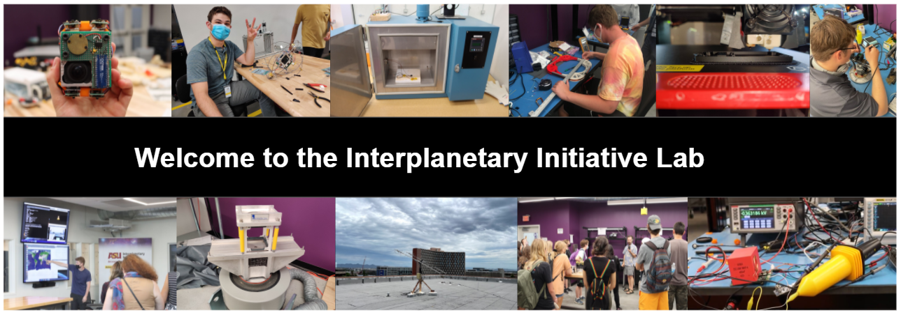
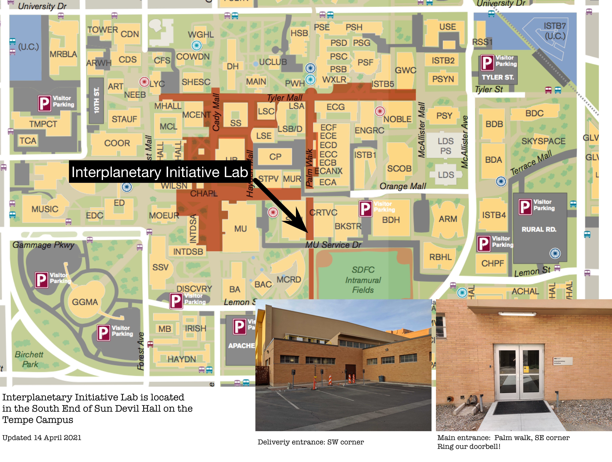

Welcome to the Interplanetary Initiative Lab Wiki. This wiki contains technical information pertaining to the lab. 

The IILab is a cross between a university training cubesat lab, a maker space, and an R&D laboratory. The 6000 sq ft facility includes collaboration space, electronics development, fabrication, assembly and test.  Test facilities include a cubesat shaker table, a thermal vacuum chamber, a small clean room, a roof deck, and air-bearing attitude test.  Some of these facilities are operational now, others are under development.  

[Student Signup](https://interplanetary.asu.edu/StudentLab). 

[Corporate/Affiliate Signup](https://interplanetary.asu.edu/LabMembers).

## Location
Tempe Campus 
Sun Devil Hall 
Main Entrance: Palm Walk 
Delivery Entrance: Southwest corner (by arrangement or inquire at main entrance)

# Lab Calendar
Lab Users can access the lab when a II-Lifeguard is present. The [Google Calendar](https://calendar.google.com/calendar/u/2?cid=Y19zcWNpdXFhb2RxM3Q1aGU1MHIxNzc3Zm9wa0Bncm91cC5jYWxlbmRhci5nb29nbGUuY29t) tracks when lifeguards are scheduled to be in the lab.

## Lab Rules
1. To work in the lab one must be a current IILab User, see below. Visitors are ok but can't use any equipment until registered as a User. 
2. Keycard access can be granted, see SuperUser level access below.

## Lab Schedule
An II-Lifeguard must be present during ordinary student use of the lab. The lab is open when a lifeguard is present, see the lifeguard [google calendar](https://calendar.google.com/calendar/u/2?cid=Y19zcWNpdXFhb2RxM3Q1aGU1MHIxNzc3Zm9wa0Bncm91cC5jYWxlbmRhci5nb29nbGUuY29t). Other times on evenings and weekends can usually be arranged, please make a request in the #iilab slack channel. 

## Users 
### User Privileges
1. Access to IILab slack, google drive documentation, and internal github repositories
2. Permission to use lab equipment, keep things in the lab, etc. (Equipment reservation is currently not required but might be introduced in the future.)

### User Responsibilities 
1. Be current on ASU training as assigned in the [User Manual](https://github.com/InterplanetaryLab/II-LAB_User_Guide) 
2. Know and use IILab documentation in the Users google drive.
3. Communicate with lifeguards. Let them know when you arrive, what you're working on, and when you leave.
4. Ask for things you need
5. Report equipment problems or when something is out of stock

## Super-users
Super-users have all privileges of a User but are granted door access to the lab and permission to work without Lifeguard supervision. With great power comes great responsibility!
### Super User Responsibilities.
1. Give 12 hours advance notice for lab use after 5pm, on a weekend, or ASU holiday.
2. Report anything out of the ordinary to lifeguards and Danny.
3. Regular Users may be present but _only if directly under the supervision of the Super user_.

# Equipment & Facilities 
See navigation side bar for the various equipment/facilities pages
